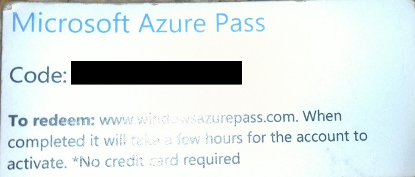
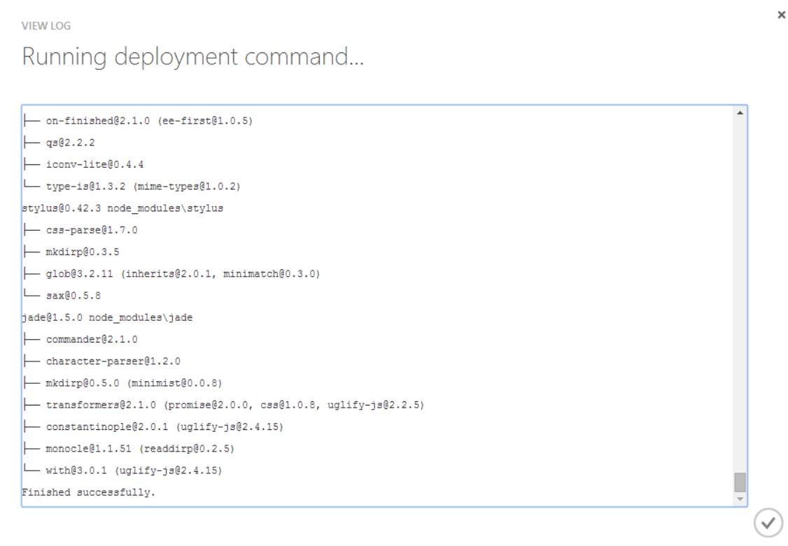

# Building Hyper Scalable Web APIs for your Apps -- Fast!

## Objective

At the end of this lab you will know

- How to create a Web API using Node.js Express 4 in 5 minutes or less
- What middleware is and how to enforce API keys with it
- How to use routers to define API routes

## Introduction

This lab will use Azure Websites with the Monaco Browser-based IDE. Monaco provides intelligent auto-completion, javascript validation, git integration, and command line to provide you with an ultimate, fast all-in-one Node.js website and API development environment.

**Requirements**

- An Azure token provided by @sedouard
- A computer with a modern web browser


## Getting Started

To get started first grab your Azure token provided by me, @sedouard. It will look something like this:



After you sign up for your **free** Azure subscription, you can spin up 2 Azure Websites. One will be your **dev** website and the other will be your **production** website.

First, go to **current** Azure portal (manage.windowsazure.com) not to be confused with the new portal (portal.azure.com). In this portal we will create website by hitting the big **'+'** on the bottom left side and creating a new website with **Quick Create**. Be sure to name the first side with the suffix **-dev** and the second with **-prod**. This will help us differentiate between our development environment and production deployment.


Do this one more time for your Azure Website with the suffix **-prod**.

In your websites listing you should see the two new websites you just created:


Click on the website URL of either page and you'll see a placeholder waiting for you:


For the time being, we will focus on the **-dev** website, which will be our development workspace. To get to the Monaco Integrated Development Environment (IDE) click on your website name in the list and go to the **Configure** tab:


Look for the setting, **'Edit in Visual Studio Online'**. This will enable the Monaco development environment for you to use on this website. Be sure to click save at the bottom:


Now, go back to the **Dashboard tab** and click the link that says '**Edit in Visual Studio Online'**:


## The Monaco Editor

When you do the previous step you'll be hurled into a completely new environment, the Monaco Development Environment which allows you to create full fledged websites and APIs that are hyper scalable.

Notice that the IDE looks pretty bare with almost nothing in it besides the default place holder page:


Delete **hostingstart.html** and install the **[express](http://npmjs.org/express)** template generator from **[npm](http://npmjs.org)**. Open up the console by clicking this icon on the left menu bar:


This will give you a regular command prompt where we can use **npm**. Use this command to install a basic express application:

```batch

npm install -g express-generator

```

Now, to create a basic express template app, execute this command

```batch
express --css stylus .
npm install
```

This will create all of your express framework files and install the necessary modules. You should now have a full file/folder browser with all the required files:


Open up App.js and you'll see we have a fully syntax highlighted javascript editor. Notice how the Node.js global **__dirname** has squigglies under it. This is because the editor doesn't know about their declaration: 


We can quickly fix this by using [Typescript](http://typscriptlang.org), an open source compile-to-javascript language which allows for typings. This allows the editor to know these declarations. First add the typescript definition command line interface which will allow us to add the typings:

```batch
npm install -g tsd
```

Then use **tsd** to install the node.js typings and the express typings:

```batch
tsd query node --action install
tsd query express --action install
```
This will install the latest node.js and express API typings to a new folder called typings:


We easily add references via triple-slash comments to the typing files by adding '/// ' plus the **reference** tag. This is seen as a comment but the editor (which can also understand TypeScript) will interpret this information. Now you can see rich jsDoc and typing information right into the editor. 


## Creating the API router

By default express creates a default web page. We don't really need this but it doesn't hurt that it's there. Lets create a new router by adding a new file, **api.js** into the **routes** folder. You can do this by just right clicking on the routes folder and creating a new file:


Use this starter code which creates an [Express Router](http://expressjs.com/4x/api.html#router) and exposes it for use in app.js:

```js
var express = require('express');

// Create an new Express Router
var router = express.Router();

// Set the GET HTTP verb handler for '/demo' paths on this route.
router.get('/demo', function(req, res) {
  //send a simple message
  res.send({message:'Just created an API in 5 minutes!'});
});

//expose this module's router to be used by the application
module.exports = router;

```
**routes/api.js**

A router can be thought of as a bundle of API handlers and middlewares. You can think of it as its own tiny application which has routes and such. Routers can be 'mounted' from any path on your main application. This router defines one route **/demo** 

Take a look at how we add this router in app.js. First we add a **require** on the app.js file:

```js
var api = require('api');
```
**app.js**
Now, we'll place the api router at an appropiate path on our server, say **/api**:


```js
app.use('/', routes);
app.use('/users', users);
//add the API route
app.use('/api', api);
```
**app.js**

Now all routes available in the **api** router will be 'mounted' at /api. This means we can do a GET request on **/api/demo** and should receive the test message.

To start our web server, hit the play button on the left side bar:


Your web server will start and your window will split with a console window to your right. This console window will show all of your server output. Use your favorite rest client like [Advanced Rest Client](https://chrome.google.com/webstore/detail/advanced-rest-client/hgmloofddffdnphfgcellkdfbfbjeloo) for chrome to send a GET request to **yourservername-dev.azurewebsites.net**:


### Enforcing an API key with Middleware

Often times we don't want just any random application calling our API. A simple use of [Middleware](http://expressjs.com/api.html#middleware.api) can be to insert some code between when our call is recieved and when its responded to check if the API call has a valid API key. For this case, we want to enforce this requirement just on the API, although with express you can enforce this on the entire application as well. We can easily do this by using the **use** method on the API router:

```js
//add middleware to check for an API key for any request
//to this route 
router.use(function(req, res, next){

  if(!req.query.api_key){
    return res.send({message:'Must have API key ' } );
  }
  
  //check if this API key is 'valid'
  //in a real scenario you would check this against
  //a data source such as a file, cache or database
  if(req.query.api_key != '12345'){
    return res.send({message:'Invalid API key'});
  }

});
```
**routes/api.js**

### So You Want to Work as a Team?

You can easily use Github or Bitbucket to provide source control and use your production website for building, testing and deploying your website for [Continuous Integration](http://en.wikipedia.org/wiki/Continuous_integration).


For this example we'll use github. Create a [github repository](https://help.github.com/articles/creating-a-new-repository). After you've created it, click the git icon in the menu bar and click **Initialize Git Repository**.


This is the equivalent of **git init** on the command line. Notice how Monaco wants to add a zillion files:


We need a handy .gitignore. Lets add this file to the root of our repository:

```gitignore
# Logs
logs
*.log

# Runtime data
pids
*.pid
*.seed

# Directory for instrumented libs generated by jscoverage/JSCover
lib-cov

# Coverage directory used by tools like istanbul
coverage

# Grunt intermediate storage (http://gruntjs.com/creating-plugins#storing-task-files)
.grunt

# Compiled binary addons (http://nodejs.org/api/addons.html)
build/Release

# Dependency directory
# Deployed apps should consider commenting this line out:
# see https://npmjs.org/doc/faq.html#Should-I-check-my-node_modules-folder-into-git
node_modules
```
After adding this file you'll see that we now have a reasonable amount of files to commit:


Now, open up the console, which has all of our git commands. We'll commit to this repository and add our github repo as our remote origin.

```bash
# Add ll of our files to the repo
git add .
# Commit to local repo
git commit . -m 'initial commit!'
# Set github repo as the origin
git remote add origin https://github.com/sedouard/APIsFastMonaco.git
```

Now we created our production site for a reason. This will be your production site which can run continuous integration deployments. You can share this server with your friends.

Go to your production website dashboard and click **Set up deployment from source control**:


Now, select Github as your source control provider (you can also use any of the other services listed) and select next:


The Azure portal will attempt to do an OAuth authentication to Github. Complete the login process and you will see all of your repositories listed. Select the repository you created in Github:


Now, go back to the Monaco IDE, and push your code to your github repository:

```bash
#Push to github repository. This will trigger a commit
git push origin master
```

Monaco will ask you for your credentials to your repository. Just enter your Github credentials:


Now quickly switch back to your Azure production site dashboard. You'll see that your website is beginning to deploy:


After a few moments the website will deploy and the deployment will contain a link the the github commit and the deployment log which shows that all the modules were installed and the website was launched:



Browse to your website and you'll see that your website (and API) has been launched into production! This is the best way to work with your friends on your project.

## Want to run Continuous Integration Build Tasks and Tests?

Check out [this guide](https://github.com/sedouard/AzureDevopsLabs/tree/master/CI) which shows you how to use custom deployment scripts to run [grunt](http://gruntjs.com/) tasks and [mocha](http://visionmedia.github.io/mocha/) unit tests!